# Image-Processing-Techniques
Image Processing using OpenCV

[](#whats-here)
[](requirements.txt)
[](#opencv-5x-notebooks)
[](LICENSE)

A 45-notebook walkthrough of computer vision with OpenCV — from loading your
first image through classical CV (background subtraction, optical flow,
object tracking) to modern DNN-based techniques (YOLOX, LaMa, MobileSAM,
DISK + LightGlue) run via `cv2.dnn` and `onnxruntime`. Every notebook runs
top to bottom and renders its results inline: static outputs as embedded
plots, motion outputs as autoplaying GIFs *and* real scrubbable video
players, no local GUI or download step required.

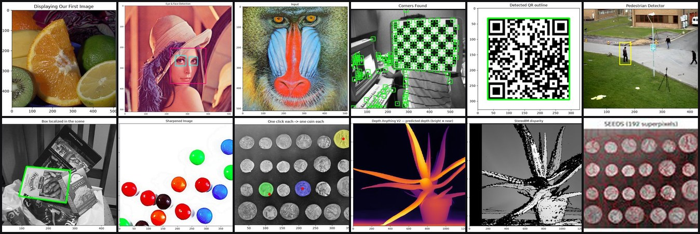

## What's here

|  | # | Notebook | Covers |
|---|---|----------|--------|
| 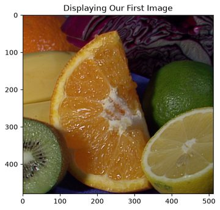 | 01 | Getting started with images | imread/imshow/imwrite, image shape |
| 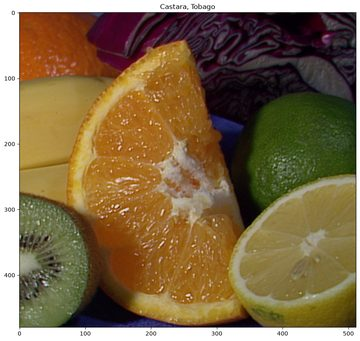 | 02 | Grayscaling in Images | `cvtColor` to grayscale |
| 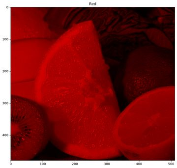 | 03 | Color Spaces | BGR channels, HSV |
| 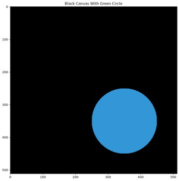 | 04 | Drawing on images | lines, rectangles, circles, polygons, text |
| 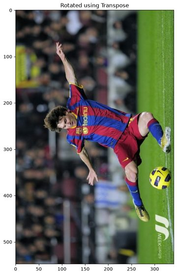 | 05 | Transformations | translation, rotation, flipping |
| 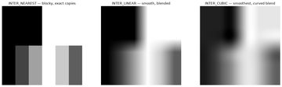 | 06 | Scaling, Resizing & Cropping | interpolation methods, image pyramids |
| 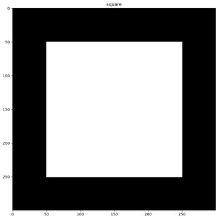 | 07 | Arithmetic & Bitwise Operations | add/subtract, AND/OR/XOR/NOT, masking |
| 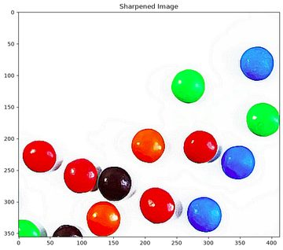 | 08 | Convolutions, Blurring & Sharpening | kernels, denoising |
| 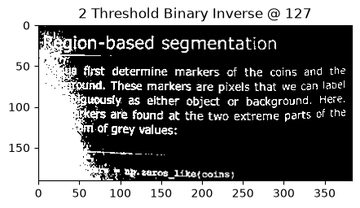 | 09 | Thresholding & Binarization | global, adaptive, Otsu, scikit-image local |
| 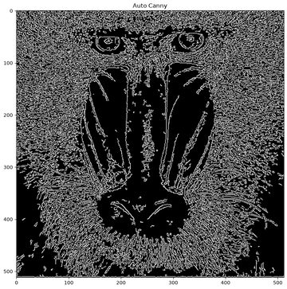 | 10 | Dilation, Erosion & Edge Detection | morphology, Canny, auto-Canny |
| 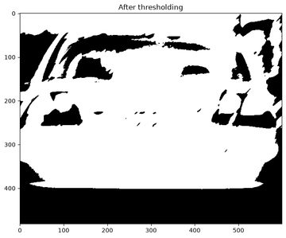 | 11 | Contours | `findContours` retrieval modes & approximation |
| 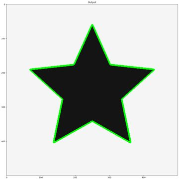 | 12 | Sorting & Matching Contours | moments, `approxPolyDP`, convex hull, `matchShapes` |
| 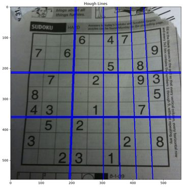 | 13 | Line, Circle & Blob Detection | Hough lines/circles, `SimpleBlobDetector` |
| 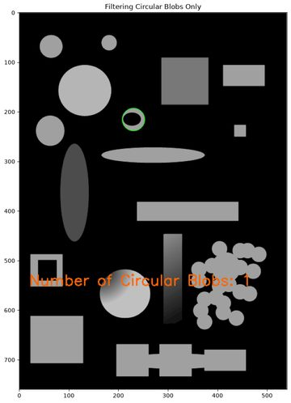 | 14 | Counting Circles & Template Matching | blob filtering, `matchTemplate` |
| 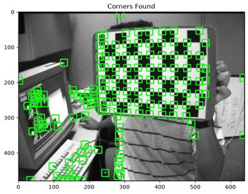 | 15 | Finding Corners | Harris, `goodFeaturesToTrack` |
| 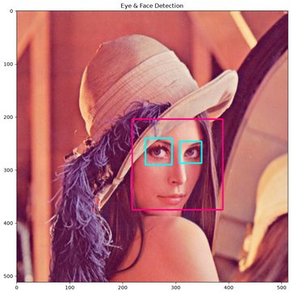 | 16 | Face & Eye Detection | Haar cascades, webcam capture |
| 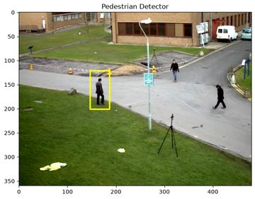 | 17 | Vehicle & Pedestrian Detection | Haar cascade + background-subtraction detection on video |
| 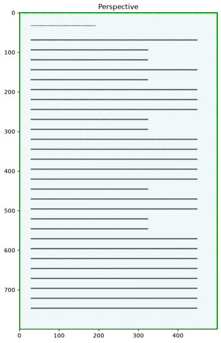 | 18 | Perspective Transforms | `getPerspectiveTransform`, document unwarping |
| 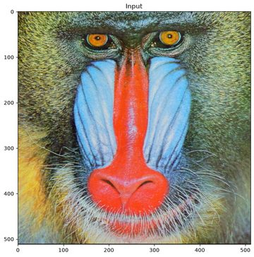 | 19 | Histograms & K-Means Color Analysis | channel histograms, dominant-color clustering |
| 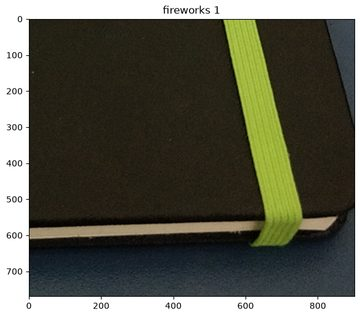 | 20 | Comparing Images | MSE, structural similarity |
| 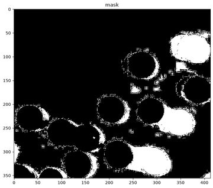 | 21 | Filtering Colors | HSV color-range masking |
| 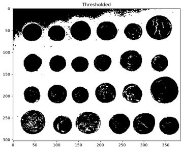 | 22 | Watershed Segmentation | marker-based segmentation of touching objects |
| 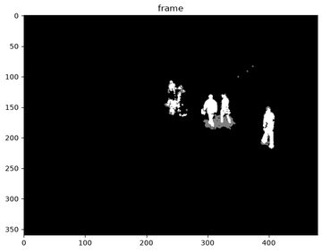 | 23 | Background Subtraction | MOG2, KNN, running-average foreground masks |
|  | 24 | Motion Tracking | meanshift, CAMSHIFT |
| 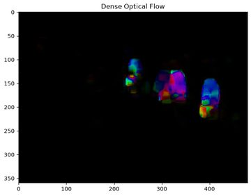 | 25 | Object Tracking with Optical Flow | Lucas-Kanade (sparse), Farneback (dense) |
|  | 26 | Single Object Tracking by Color | HSV threshold + contour tracking |
| 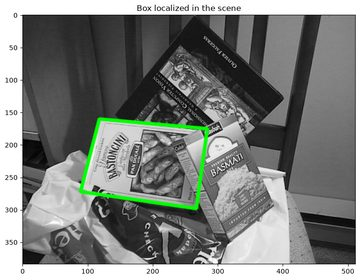 | 27 | Feature Detection & Matching | SIFT/ORB/AKAZE, BFMatcher + Lowe's ratio test, RANSAC homography, object localization |
| 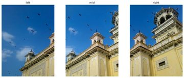 | 28 | Image Stitching & Panoramas | `cv2.Stitcher`, bundle adjustment/seam finding/exposure compensation, built on notebook 27's matching pipeline |
| 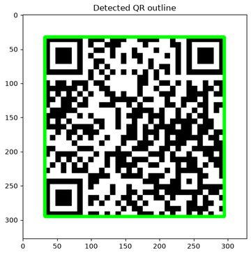 | 29 | QR Code & Barcode Detection | `cv2.QRCodeDetector`, `cv2.barcode.BarcodeDetector`, generate-then-decode round trip |
| 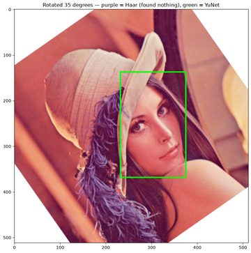 | 30 | Modern Face Detection with YuNet (DNN) | `cv2.FaceDetectorYN`, head-to-head against notebook 16's Haar cascade — landmarks, rotation robustness, speed |
| 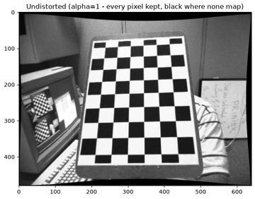 | 31 | Camera Calibration & Lens Undistortion | `cv2.calibrateCamera`, chessboard corner detection across 13 photos, `cv2.undistort` |
| 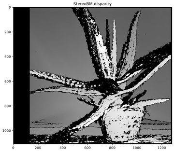 | 32 | Stereo Vision & Disparity Maps | `cv2.StereoBM` / `cv2.StereoSGBM`, disparity-to-depth relationship, checked against real ground truth |
| 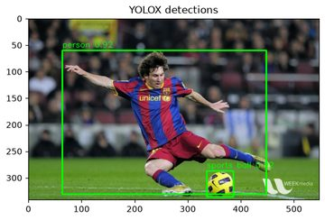 | 33 | DNN Object Detection with YOLOX | `cv2.dnn` + ONNX, letterbox/grid-decode/NMS pipeline, compared against notebook 17's background subtraction |
| 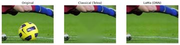 | 34 | Image Inpainting: Classical vs. LaMa (DNN) | `cv2.inpaint` vs. LaMa, a generative DNN inpainter built into OpenCV 5 — **needs the separate `.venv5x` environment, see below** |
| 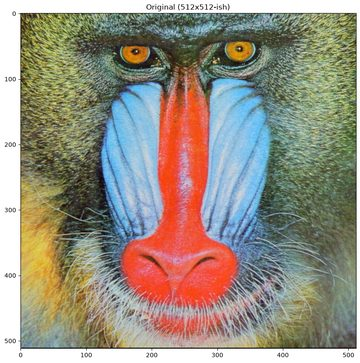 | 35 | Image Super-Resolution: Classical vs. Learned | `cv2.dnn_superres` (ESPCN, FSRCNN) vs. bicubic, cross-checked with notebook 20's MSE/SSIM plus PSNR — where the numbers and the eye test disagree, and why |
| 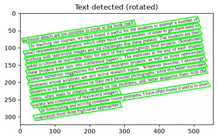 | 36 | Text Detection with DB | `cv2.dnn_TextDetectionModel_DB`, upright vs. rotated text, straightening a detected line with notebook 18's perspective-warp technique |
| 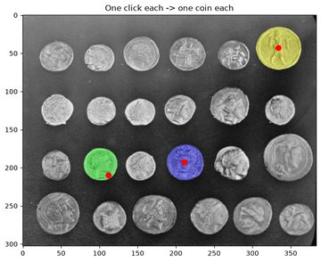 | 37 | Promptable Segmentation with MobileSAM | `onnxruntime` encoder/decoder pair, click-a-point segmentation, contrasted with notebook 22's unsupervised Watershed on the same `coins.jpg` |
| 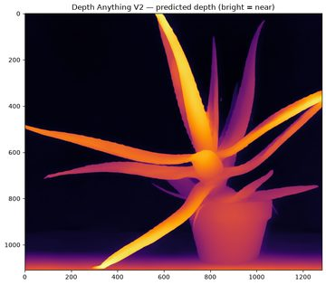 | 38 | Monocular Depth Estimation vs. Classical Stereo | Depth Anything V2 Small (single photo, `onnxruntime`) graded against the same real ground truth (`aloeGT.png`) notebook 32 used for `StereoSGBM` — surprisingly close on this scene |
| 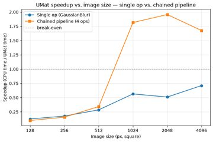 | 39 | GPU Acceleration with cv2.UMat | The Transparent API's automatic OpenCL dispatch, honestly benchmarked — single op vs. chained pipeline, across image sizes, on real hardware |
| 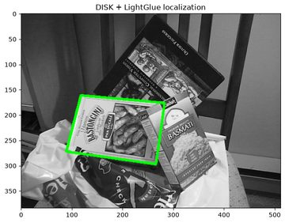 | 40 | Modern Learned Feature Matching: DISK + LightGlue | `onnxruntime`, a fused DISK+LightGlue ONNX pipeline, localizing the exact same object as notebook 27's classical SIFT/RANSAC on the same photo pair |
| 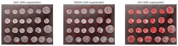 | 41 | Superpixel Segmentation: SLIC, SEEDS & LSC | `cv2.ximgproc`, no external model — tested directly against notebook 22's exact tuned Watershed pipeline on the same `coins.jpg`, including a real case where Watershed's threshold fails and superpixels don't |
| 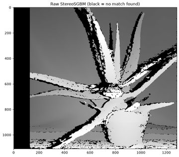 | 42 | Disparity Refinement: WLS & Guided Filters | `cv2.ximgproc`'s edge-aware filters densify notebook 32's raw `StereoSGBM` holes, graded against the same `aloeGT.png` ground truth for both density and accuracy |
|  | 43 | Robust Estimation: RANSAC vs. USAC/MAGSAC++ | Same `cv2.findHomography` call, one argument changed — rerun on notebook 27's exact SIFT matches, identical accuracy at 20-70x less runtime on noisy data |
| 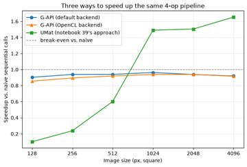 | 44 | G-API Graph Pipelining vs. Naive vs. UMat | `cv2.gapi`'s graph-fused execution, benchmarked the same honest way as notebook 39 — a genuinely different mechanism from `UMat`, and on this pipeline/hardware, not the faster one |
| 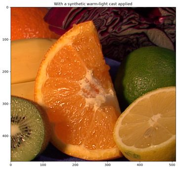 | 45 | Automatic White Balance with cv2.xphoto | `GrayworldWB` vs. `SimpleWB` correcting a known synthetic color cast on notebook 3's `castara.jpeg`, scored against real ground truth — a real assumption failure, and a numeric-vs-visual surprise echoing notebook 35 |

Notebooks 27-45 were added after the original 26-notebook rewrite, filling
gaps the series didn't cover yet (feature matching, stitching, 1D/2D code
detection, DNN-based detection, camera calibration, stereo vision, generative
inpainting, super-resolution, text detection, promptable segmentation,
monocular depth, GPU acceleration, modern learned feature matching,
superpixel segmentation, disparity refinement, robust estimation, graph
pipelining, white balance) — see the "Develop" section for the scripts that
build them.

**Notebook 40 uses `onnxruntime`, not `cv2.ALIKED`/`cv2.LightGlueMatcher`.**
OpenCV 5.x's Python API for those classes exists in
`opencv-contrib-python-headless==5.0.0.93` and is confirmed working, but the
actual pretrained ONNX weights those *specific* classes expect
(`aliked-n16rot-top1k-640.onnx`, `aliked_lightglue.onnx`) still aren't
published anywhere publicly redistributable as of this writing — not in
`opencv_zoo`, not in `opencv_zoo`'s Hugging Face org, and the one place
they're referenced by filename (`opencv/opencv`'s own
`modules/features/test/test_aliked_lightglue.cpp`, via
`cvtest::findDataFile`) resolves against a private/internal `opencv_extra`
test-data path that isn't in the public `opencv_extra` repo — this is an
active [GSoC 2026 project](https://forum.opencv.org/t/gsoc-2026-intro-neural-feature-matching-aliked-lightglue/24410),
not yet shipped. Notebook 40 gets the same technique a different way instead
of leaving it out: DISK + LightGlue via `onnxruntime` directly, same pattern
as notebooks 37 (MobileSAM) and 38 (Depth Anything) — see that notebook's
assets note for the full license trail.

Every lesson closes with a short, plainly-worded section of a few concrete,
runnable extensions of that notebook's technique — not just a summary of
what was covered, and not the same stamped heading repeated 26 times.

Notebooks whose technique has real math worth unpacking also get an
intuitive, from-scratch explanation of *why* it works, right where the
concept first appears — not just a link to a paper. A few get a small
generated diagram because a picture genuinely beats prose there: interpolation
methods made visible by zooming into a tiny image (06), a convolution kernel
sliding over actual numbers (08), the Hough-transform "points become
sinusoids, collinear points' sinusoids cross at one point" trick (13), the
Harris corner flat/edge/corner eigenvalue plane (15), and a worked integral-image
example (16). Others (Otsu's threshold, image moments, homographies, K-means,
MSE vs. SSIM, watershed's distance transform, Gaussian-mixture background
models, meanshift/CAMSHIFT, the Lucas-Kanade optical flow equation) get a
tight written explanation in place. Notebook 27 explains keypoints/descriptors,
Lowe's ratio test, and RANSAC the same way; notebook 29 covers why Reed-Solomon
error correction lets a QR code survive real damage.

## Setup

```bash
python3 -m venv .venv
source .venv/bin/activate   # .venv\Scripts\activate on Windows
pip install -r requirements.txt
jupyter notebook
```

That's it — `assets/images/`, `assets/videos/`, `assets/haarcascades/`, and
`assets/models/` ship with the repo, so nothing needs to be downloaded
before running a notebook top to bottom.

### OpenCV 5.x notebooks

Notebook 34 needs a **second, separate environment** — it's the only one in
this repo built against `opencv-contrib-python-headless==5.0.0.93` instead
of the `4.10.0.84` every other notebook is pinned to. This isn't a
convenience choice: its LaMa model uses an ONNX op (`DequantizeLinear`) that
OpenCV 4.x's DNN importer cannot parse at all, confirmed by actually running
it, not just by reading OpenCV's docs. Setting it up:

```bash
python3 -m venv .venv5x
.venv5x/bin/pip install -r requirements-5x.txt
.venv5x/bin/python3 -m ipykernel install --prefix="$(pwd)/.venv5x" \
    --name python3-cv5 --display-name "Python 3 (OpenCV 5.x)"
.venv5x/bin/jupyter notebook   # open notebook 34, select the "OpenCV 5.x" kernel
```

Every other notebook in this repo (1-33, 35-45) stays on the original
`.venv` / `requirements.txt` — only open notebook 34 with `.venv5x`.

`requirements.txt` pins `opencv-contrib-python-headless==4.10.0.84` — the
"contrib" wheel, not the plain `opencv-python-headless` this repo used until
notebook 35 needed `cv2.dnn_superres` (contrib-only). Confirmed a safe,
drop-in swap by re-executing every one of the other 32 main-`.venv`
notebooks against it unchanged before switching. The `4.10.0.84` version
itself is pinned because the `5.0.0` headless wheel available at the time of
writing shipped without `cv2.CascadeClassifier` — not a temporary packaging
gap: [OpenCV's own 4→5 migration notes](https://github.com/opencv/opencv/wiki/OpenCV-4-to-5-migration)
say Haar cascades moved to `opencv_contrib`'s `xobjdetect` module in 5.x, with
DNN-based face detection recommended as the replacement — see notebook 30,
which runs that replacement (`cv2.FaceDetectorYN` / YuNet) side by side with
notebook 16's Haar cascade.

## A note on the sample assets

The original course this repo is based on distributed its images, video
clips, and Haar cascade files separately from the notebooks (a `!wget` /
`!unzip` step against links that have since gone stale) — none of it was
ever committed to git here, in any past commit. Every notebook still expects
those files at their original relative names, so `assets/images/`,
`assets/videos/`, and `assets/haarcascades/Haarcascades/` in this repo are a
real, working replacement set, wired up under (mostly) those same names —
all consolidated under a single top-level `assets/` folder rather than
scattered loose at the repo root:

- **Real photos/scenes** — sourced from **[OpenCV's own official sample
  data](https://github.com/opencv/opencv/tree/4.x/samples/data)**
  (`fruits.jpg`, `messi5.jpg`, `lena.jpg`, `sudoku.png`, `cards.png`,
  `left01.jpg`, `licenseplate_motion.jpg`, `ela_original/modified.jpg`, and
  more) and **[scikit-image](https://scikit-image.org/)**'s bundled samples
  (`coins`, `page`) — both permissively licensed and exactly the kind of
  imagery these lessons were originally written against.
- **Haar cascades** — the official `haarcascade_frontalface_default.xml`,
  `haarcascade_eye.xml`, and `haarcascade_fullbody.xml` from
  [opencv/opencv](https://github.com/opencv/opencv/tree/4.x/data/haarcascades).
  There's no officially-maintained, clearly-licensed `haarcascade_car.xml` —
  the copies that circulate in tutorials trace back to an old forum post
  with no formal license — so notebook 17's vehicle detection uses
  background subtraction instead (see the note in that notebook).
  `assets/models/face_detection_yunet_2023mar.onnx` (notebook 30) is the
  YuNet DNN face detector from OpenCV's own model zoo
  ([opencv/opencv_zoo](https://github.com/opencv/opencv_zoo/tree/main/models/face_detection_yunet),
  MIT-licensed, own `LICENSE` file in that directory) — the fixed-input-shape
  build, chosen specifically because it works with this repo's pinned
  OpenCV 4.x DNN module (the newer dynamic-shape export in the same
  directory targets OpenCV 5.x's ONNX Runtime engine instead).
  `assets/models/object_detection_yolox_2022nov_int8.onnx` (notebook 33) is
  YOLOX-s, also from
  [opencv/opencv_zoo](https://github.com/opencv/opencv_zoo/tree/main/models/object_detection_yolox)
  (Apache 2.0) — the int8-quantized export (~9MB vs. ~36MB full precision),
  chosen over the better-known Ultralytics YOLO releases specifically
  because those are AGPL-3.0, a copyleft license that doesn't fit a repo
  meant to be freely reused.
  `assets/models/ESPCN_x4.pb` / `FSRCNN_x4.pb` (notebook 35) are official
  OpenCV GSoC 2019 contributions, linked directly from
  [opencv_contrib's own `dnn_superres`
  README](https://github.com/opencv/opencv_contrib/tree/4.x/modules/dnn_superres)
  — [fannymonori/TF-ESPCN](https://github.com/fannymonori/TF-ESPCN) and
  [Saafke/FSRCNN_Tensorflow](https://github.com/Saafke/FSRCNN_Tensorflow),
  both Apache 2.0 and genuinely tiny (~100KB / ~42KB).
  `assets/models/text_detection_en_ppocrv3_2023may.onnx` (notebook 36) is
  PP-OCRv3's text detector, also from
  [opencv/opencv_zoo](https://github.com/opencv/opencv_zoo/tree/main/models/text_detection_ppocr)
  (Apache 2.0, 2.4MB) — used instead of `cv2.dnn_TextDetectionModel`'s other
  supported architecture, EAST, because the EAST weights OpenCV's own sample
  code points learners to are a Dropbox link and a Google Drive link, neither
  scriptably fetchable nor as clearly licensed as everything else this repo
  bundles. `assets/images/imageTextN.png` / `imageTextR.png` (real book-page
  text, upright and rotated) are OpenCV's own official samples too.
  `assets/models/inpainting_lama_2025jan.onnx` (notebook 34) is LaMa, from
  [opencv/inpainting_lama](https://huggingface.co/opencv/inpainting_lama) on
  Hugging Face (Apache 2.0, originally [advimman/lama](https://github.com/advimman/lama)).
  **This one is ~92MB — by far the largest asset in this repo** (everything
  else is under 10MB); no smaller quantized export was available from
  OpenCV's own distribution at the time of writing. Flagged here rather than
  quietly bundled, since it's a real outlier in size.
  `assets/models/mobilesam_encoder.onnx` / `mobilesam_decoder.onnx`
  (notebook 37) are MobileSAM's split ONNX export, from
  [Acly/MobileSAM](https://huggingface.co/Acly/MobileSAM) on Hugging Face
  (MIT) — traced to the official
  [ChaoningZhang/MobileSAM](https://github.com/ChaoningZhang/MobileSAM)
  (Apache 2.0), weights also mirrored at
  [dhkim2810/MobileSAM](https://huggingface.co/dhkim2810/MobileSAM). Not in
  `opencv_zoo` (no SAM-family model there yet) and loaded with
  `onnxruntime` directly rather than `cv2.dnn` — see the note in that
  notebook.
  `assets/models/depth_anything_v2_small.onnx` (notebook 38) is
  [depth-anything/Depth-Anything-V2-Small](https://huggingface.co/depth-anything/Depth-Anything-V2-Small)
  (Apache 2.0 — the larger Base/Large checkpoints in the same family are
  CC-BY-NC-4.0 and were deliberately not used here), exported to ONNX by
  [onnx-community](https://huggingface.co/onnx-community/depth-anything-v2-small)
  (also Apache 2.0), the `model_quantized.onnx` variant (~27MB). Also
  loaded with `onnxruntime` directly, same reason as MobileSAM above.
  `assets/models/disk_lightglue_pipeline.onnx` (notebook 40) fuses DISK
  feature extraction and LightGlue matching, from
  [fabio-sim/LightGlue-ONNX](https://github.com/fabio-sim/LightGlue-ONNX)
  (Apache 2.0), release
  [v2.0](https://github.com/fabio-sim/LightGlue-ONNX/releases/tag/v2.0)
  (~50MB). Traced to the official
  [cvg/LightGlue](https://github.com/cvg/LightGlue) (Apache 2.0) — whose own
  README confirms DISK carries the same license (unlike the other extractor
  it supports, SuperPoint, which is restrictive and wasn't used here). See
  that notebook for why this bypasses OpenCV 5's still-unshipped native
  `cv2.ALIKED`/`cv2.LightGlueMatcher` classes.
- **Procedurally generated** — where no suitable real sample existed:
  the contour-sorting shape set (`4star`, `bunchofshapes`, `hand`, `house`,
  `shapestomatch`), the Hough-circle scene, and the skewed "scanned
  document" for perspective transforms — all built by
  `scripts/generate_assets.py`, so they're fully reproducible from code.
  Notebook 14's "find the target in a busy scene" demo is a from-scratch
  template-matching exercise, not the original book's Where's Waldo art
  (which isn't ours to redistribute).
- **`assets/videos/walking.avi` / `assets/videos/walking_short_clip.mp4`** —
  a trimmed, downscaled clip of OpenCV's own `vtest.avi` sample (people
  crossing a plaza), used for pedestrian detection, background subtraction,
  and optical flow.
- **`assets/images/box.png` / `box_in_scene.png`** (notebook 27) — OpenCV's
  own classic feature-matching sample pair: a clean product photo and the
  same box rotated and partly occluded in a cluttered scene.
- **`assets/images/pano_left/mid/right.jpg`** (notebook 28) — three
  overlapping "camera positions" derived from `assets/images/home.jpg`
  (also an OpenCV official sample) with independent perspective jitter and
  brightness/contrast shifts applied to each, generated by
  `scripts/generate_assets.py`. Real, clearly-licensed sets of overlapping
  photos turned out to be genuinely hard to find at redistribution-safe
  terms — even `opencv_extra`'s own stitching test data ships with no
  LICENSE file — so these are synthetically split from one real photo
  instead, which is still enough baseline for `cv2.Stitcher` to do real
  matching, warping, and blending.
- **`assets/images/calib/left01-14.jpg` / `right01-14.jpg`** (notebooks 31, 32)
  — OpenCV's own official calibration sample photos, 13 shots of the same
  checkerboard from a left and a right camera. The exact dataset OpenCV's
  own calibration and stereo tutorials use.
- **`assets/images/aloeL.jpg` / `aloeR.jpg` / `aloeGT.png`** (notebook 32) —
  OpenCV's own official stereo sample: a real rectified stereo pair with a
  genuine, independently-measured ground-truth disparity map.
- **Notebook 29's QR code and barcode** aren't bundled assets at all — the
  notebook generates them on the fly with `qrcode` / `python-barcode` (two
  new dependencies, used only there) and decodes them right back, so it's
  fully self-contained.
- **Real vehicle footage** (notebooks 17, 24, 26) — `assets/videos/cars.mp4`
  is a real multi-lane highway clip from
  [Pixabay](https://pixabay.com/videos/highway-traffic-vehicles-cars-road-56310/)
  (Pixabay Content License — free, no attribution required), used for
  notebook 17's background-subtraction vehicle detector, where real traffic
  makes for a better multi-object stress test than one synthetic car ever
  could. `data_slow.flv` / `car-detection.mp4` are the same
  `slow_traffic_small.mp4` clip OpenCV's own official meanshift/CAMSHIFT
  tutorials use (see `samples/python/tutorial_code/video/meanshift/` in
  [opencv/opencv](https://github.com/opencv/opencv)) — one clearly dominant
  car, which is exactly what single-object tracking (24, 26) needs. It's
  hosted on a third-party tutorial site with no formally stated license, not
  OpenCV's own repo — flagged here rather than glossed over. Both are
  reproducible via `scripts/fetch_traffic_videos.sh`.

A couple of notebooks needed a small, called-out code fix alongside the
asset swap — a real Hough-line shape-compatibility issue across OpenCV
versions, a `np.int0` removal in NumPy 2.0, and a genuine pre-existing bug in
the meanshift/CAMSHIFT setup (the tracked-object histogram was being built
from the whole frame instead of the crop) that only surfaced once the
notebook was actually run against real output. Each is commented in place.

## How the inline video/GIF rendering works

`nb_utils.py` (imported by the video-heavy notebooks) provides:

- `show()` / `show_grid()` — matplotlib display with the BGR→RGB fix,
  single image or side-by-side comparison.
- `save_gif()` / `video_to_gif()` — turns a list of frames (or an existing
  video file) into an animated GIF, embedded directly in the notebook so it
  renders in a live Jupyter session *and* in a static GitHub preview.
- `embed_video()` — base64-embeds an actual `<video>` player inline (real
  scrub/pause controls) for when you're running the notebook live.

`cv2.imshow()` / `cv2.waitKey()` never work inside a notebook — there's no
GUI event loop — so every place the original code relied on them (or wrote a
video file and never displayed it at all) now goes through one of the above
instead.

## Develop

```bash
# Regenerate the procedurally-generated assets
.venv/bin/python scripts/generate_assets.py

# Rebuild + re-execute a notebook (pass its number, or nothing for all 26)
JUPYTER_DATA_DIR="$(pwd)/.venv/share/jupyter" .venv/bin/python scripts/build_notebooks.py 17

# Rebuild + re-execute notebooks 27-29 (built from scratch, not edited from course content)
JUPYTER_DATA_DIR="$(pwd)/.venv/share/jupyter" .venv/bin/python scripts/build_new_notebooks.py

# Rebuild + re-execute notebook 30 (YuNet)
JUPYTER_DATA_DIR="$(pwd)/.venv/share/jupyter" .venv/bin/python scripts/build_nb30.py

# Rebuild + re-execute notebooks 31-32 (calibration, stereo)
JUPYTER_DATA_DIR="$(pwd)/.venv/share/jupyter" .venv/bin/python scripts/build_nb31_32.py

# Rebuild + re-execute notebook 33 (YOLOX object detection)
JUPYTER_DATA_DIR="$(pwd)/.venv/share/jupyter" .venv/bin/python scripts/build_nb33.py

# Rebuild + re-execute notebook 34 (LaMa inpainting) — needs .venv5x, not .venv
JUPYTER_DATA_DIR="$(pwd)/.venv5x/share/jupyter" .venv5x/bin/python scripts/build_nb34.py

# Rebuild + re-execute notebook 35 (super-resolution)
JUPYTER_DATA_DIR="$(pwd)/.venv/share/jupyter" .venv/bin/python scripts/build_nb35.py

# Rebuild + re-execute notebook 36 (text detection)
JUPYTER_DATA_DIR="$(pwd)/.venv/share/jupyter" .venv/bin/python scripts/build_nb36.py

# Rebuild + re-execute notebook 37 (MobileSAM promptable segmentation)
JUPYTER_DATA_DIR="$(pwd)/.venv/share/jupyter" .venv/bin/python scripts/build_nb37.py

# Rebuild + re-execute notebook 38 (monocular depth vs. stereo)
JUPYTER_DATA_DIR="$(pwd)/.venv/share/jupyter" .venv/bin/python scripts/build_nb38.py

# Rebuild + re-execute notebook 39 (cv2.UMat / OpenCL benchmark)
JUPYTER_DATA_DIR="$(pwd)/.venv/share/jupyter" .venv/bin/python scripts/build_nb39.py

# Rebuild + re-execute notebook 40 (DISK + LightGlue feature matching)
JUPYTER_DATA_DIR="$(pwd)/.venv/share/jupyter" .venv/bin/python scripts/build_nb40.py

# Rebuild + re-execute notebook 41 (superpixel segmentation)
JUPYTER_DATA_DIR="$(pwd)/.venv/share/jupyter" .venv/bin/python scripts/build_nb41.py

# Rebuild + re-execute notebook 42 (disparity refinement)
JUPYTER_DATA_DIR="$(pwd)/.venv/share/jupyter" .venv/bin/python scripts/build_nb42.py

# Rebuild + re-execute notebook 43 (RANSAC vs. USAC/MAGSAC++)
JUPYTER_DATA_DIR="$(pwd)/.venv/share/jupyter" .venv/bin/python scripts/build_nb43.py

# Rebuild + re-execute notebook 44 (G-API graph pipelining)
JUPYTER_DATA_DIR="$(pwd)/.venv/share/jupyter" .venv/bin/python scripts/build_nb44.py

# Rebuild + re-execute notebook 45 (automatic white balance)
JUPYTER_DATA_DIR="$(pwd)/.venv/share/jupyter" .venv/bin/python scripts/build_nb45.py
```

`scripts/build_notebooks.py` is idempotent only against a freshly-checked-out
notebook — it edits specific cells by matching their original source text, so
re-running it against its own output will fail to find what it's looking
for. `git checkout -- "<notebook>.ipynb"` before re-running.

`scripts/build_new_notebooks.py` is different: notebooks 27-29 have no
original-course cells to edit, so it constructs each one from scratch with
`nbformat` every time it runs — safe to re-run directly, no checkout needed.
